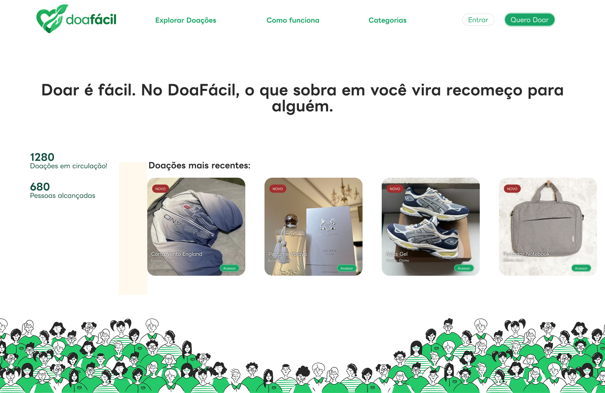
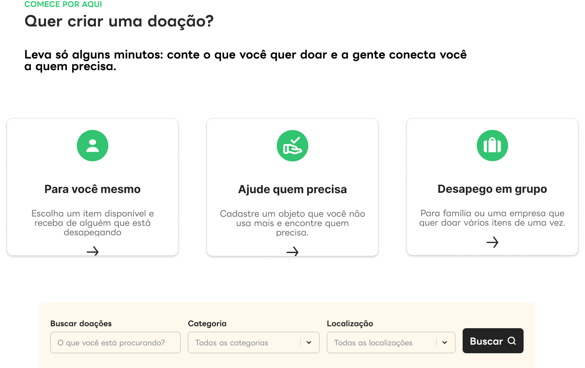
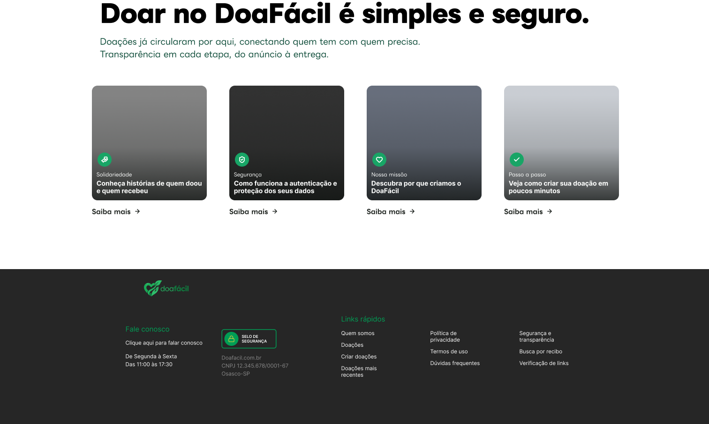

# Design do DoaFácil

Link do Figma: https://www.figma.com/design/l4MoQJUROh7b7gY3vCFTC0/doafacil?node-id=73-105&t=wvbRRiL16TnYnhQA-0

As imagens desta pasta são a referência visual do frontend (Reflex). O texto abaixo descreve cada tela e registra as decisões tomadas. Em caso de dúvida entre a imagem e este texto, vale o texto.

## Identidade visual

- Cor principal: verde. Fundo das páginas: creme claro. Textos em cinza escuro.
- Logotipo "doafácil" (coração com mãos) e ilustração de pessoas no rodapé da home.
- As cores exatas e as fontes devem ser extraídas do Figma ao implementar.

## Telas prontas

### 01-home.png — Tela inicial

- Cabeçalho: logotipo, links **Explorar Doações**, **Como funciona** e **Categorias**, botão **Entrar** e botão **Quero Doar**.
- Frase de destaque: "Doar é fácil. No DoaFácil, o que sobra em você vira recomeço para alguém."
- Estatística: "Doações em circulação".
- Seção **Doações mais recentes**: cartões com foto, etiqueta **NOVO**, título, **Condição** do item (Ótimo, Bom) e botão **Acessar**.
- Cabeçalho, destaque, doações recentes e ilustração ocupam no mínimo a altura da janela (100vh); a ilustração fica no limite inferior quando houver espaço, e "Comece por aqui" só aparece após rolar.
- Se o conteúdo inicial exceder a janela, a área cresce sem cortar conteúdo.
- Ilustração de pessoas em toda a largura, na parte de baixo da primeira área.

### 02-comece-aqui.png — Cartões de entrada

- Na home, esta seção aparece após "Doações mais recentes" e antes da seção institucional e do rodapé.
- A ilustração das pessoas permanece logo abaixo de "Doações mais recentes", em toda a largura e encostada à base da seção; não deve haver faixa de fundo creme entre ela e esta seção.
- Etiqueta "COMECE POR AQUI" e título.
- Abaixo do título, exibir em destaque e negrito: "Leva só alguns minutos: conte o que você quer doar e a gente conecta você a quem precisa."
- Três cartões:
  - **Para você mesmo**: "Escolha um item disponível e receba de alguém que está desapegando."
  - **Ajude quem precisa**: "Cadastre um objeto que você não usa mais e encontre quem precisa."
  - **Desapego em grupo**: "Para família ou uma empresa que quer doar vários itens de uma vez." Exibir a etiqueta **Em breve** e não exibir seta.
- As setas dos dois primeiros cartões são decorativas; nenhum cartão ou controle navega nesta change.
- Abaixo dos cartões, incluir uma barra de busca somente visual: campo "Buscar doações" com placeholder "O que você está procurando?", seletor "Categoria" com a opção "Todas as categorias", seletor "Localização" com a opção "Todas as localizações" e botão "Buscar". Nenhum campo ou botão realiza busca ou navega.
- Em telas estreitas, os campos da barra ficam em coluna.
- A seção usa padding vertical próximo de 5rem. Espaços: cerca de 0.75rem entre etiqueta e título, 1rem entre título e frase, 2.5rem entre frase e cartões, e 3rem entre cartões e busca.
- Cartões usam gap de cerca de 1.5rem e padding de cerca de 2rem; conteúdo alinhado no topo e seta ou "Em breve" no rodapé.
- Campo e seletores têm fundo branco, borda cinza clara e texto legível (aparência ativa), embora a busca continue sem ação.

### 03-secao-institucional-e-rodape.png — Seção institucional e rodapé

**Seção institucional e rodapé da home**

- Título: "Doar no DoaFácil é simples e seguro."
- Texto: "Doações já circularam por aqui, conectando quem tem com quem precisa. Transparência em cada etapa, do anúncio à entrega."
- Quatro cartões com ícone, categoria, título e "Saiba mais", sem fotos ou vídeos:
  - **Solidariedade** — "Conheça histórias de quem doou e quem recebeu".
  - **Segurança** — "Como funciona a autenticação e proteção dos seus dados".
  - **Nossa missão** — "Descubra por que criamos o DoaFácil".
  - **Passo a passo** — "Veja como criar sua doação em poucos minutos".
- Os cartões usam fundos em degradê verde e cinza. Os destinos de "Saiba mais" ainda não existem; os controles não navegam nesta change.
- Rodapé em fundo escuro com logotipo; abaixo dele, duas colunas: "Fale conosco", com o texto "Clique aqui para falar conosco" sem navegação, e "Links rápidos", com os links Quem somos, Doações, Criar doações, Doações mais recentes, Política de privacidade, Termos de uso, Dúvidas frequentes e Segurança e transparência em tamanho reduzido e com pouco espaço entre linhas. Em telas estreitas, as colunas ficam empilhadas.
- Usar no rodapé o mesmo arquivo colorido `assets/logo.svg` do cabeçalho, sem filtro nem recoloração; se o contraste no fundo escuro for ruim, registrar o problema sem alterar a cor por conta própria.
- Títulos do rodapé em cerca de 0.95rem; links e textos em cerca de 0.8rem, com linhas compactas; "Projeto acadêmico DoaFácil" em cerca de 0.8rem. "Clique aqui para falar conosco" sem sublinhado.
- Incluir a linha "Projeto acadêmico DoaFácil".
- Não incluir horário, e-mail ou telefone em "Fale conosco".
- Não incluir selo de segurança, CNPJ ou cidade, horário de atendimento, "Busca por recibo" ou "Verificação de links", itens herdados da referência do Vakinha.
- Em telas estreitas, os cartões das seções ficam em coluna.

## Telas ainda sem desenho

Login e cadastro, catálogo (Explorar Doações), detalhe da doação, formulário de cadastro da doação, Como funciona, Categorias.

## Referência de estrutura (Vakinha)

O site do Vakinha serve só de inspiração para a organização das páginas. Não copiar marca nem textos, e não incluir o que não se aplica ao DoaFácil: valores em reais, sorteios, avaliações de loja de aplicativos e botões de download de app (o projeto é uma plataforma web).

A referência serve apenas para inspiração estrutural, sem copiar marca ou incluir conteúdo que não tenha sido aprovado para o DoaFácil.

## Decisões tomadas

1. A **localização** da doação é a cidade e o estado do perfil do doador, copiados na hora de cadastrar a doação.
2. A barra de busca pertence à página **Explorar Doações**. A tela "Comece por aqui" é a porta de entrada.
3. A etiqueta **NOVO** vale para doações criadas nos últimos 7 dias.
4. A estatística "Pessoas alcançadas" **não entra** na primeira versão. Só "Doações em circulação".
5. **Desapego em grupo** (vários itens de uma vez) fica fora do MVP.
6. O rótulo do estado do item é **Condição** (Ótimo, Bom, Regular), para não confundir com o estado geográfico nem com o status da doação.
7. Na seção "Comece por aqui", exibir "Desapego em grupo" com a etiqueta "Em breve" e sem seta. A barra abaixo dos cartões é apenas visual nesta home e não executa busca nem navega; a busca funcional permanece exclusiva da página Explorar Doações.
8. Na seção institucional, usar os quatro cartões Solidariedade, Segurança, Nossa missão e Passo a passo com ícones, categorias, títulos e "Saiba mais", sem fotos ou vídeos; usar degradês verde e cinza. O cartão Solidariedade mantém o título "Conheça histórias de quem doou e quem recebeu", conforme a imagem de referência.
9. Os controles das seções novas, inclusive setas e links, não navegam nesta change porque suas páginas de destino ainda não existem.
10. O rodapé da home usa fundo escuro, logotipo, os oito links rápidos definidos acima e "Projeto acadêmico DoaFácil"; não inclui selo de segurança, CNPJ, cidade, horário de atendimento, "Busca por recibo" ou "Verificação de links" da referência do Vakinha.
11. As seções novas mantêm a fonte LINE Seed JP e a paleta já usada na home; a área principal segue creme e o rodapé é escuro.
12. A ilustração das pessoas permanece logo abaixo das doações recentes, ocupa toda a largura e encosta à base da seção, sem faixa de fundo creme entre ela e "Comece por aqui"; depois aparecem essa seção, a seção institucional e o rodapé escuro, nessa ordem.
13. O rodapé inclui "Fale conosco" com "Clique aqui para falar conosco", sem navegação nem dados de horário, e-mail ou telefone. O bloco fica ao lado de "Links rápidos" abaixo do logotipo em telas largas e empilhado em telas estreitas; título e links rápidos usam tipografia menor e linhas mais compactas.
14. A primeira área da home (cabeçalho, destaque, doações recentes e ilustração) tem no mínimo 100vh, com ilustração encostada à base e sem exibir “Comece por aqui” na primeira dobra; quando o conteúdo ultrapassa a viewport, a área cresce sem cortes.
15. A seção “Comece por aqui” usa espaçamentos e cartões arejados conforme definidos acima; a busca visual tem controles brancos, borda cinza clara e texto legível, sem executar busca.
16. O rodapé preserva o logotipo colorido original, sem filtro; títulos em cerca de 0.95rem, textos e links em cerca de 0.8rem e texto de contato sem sublinhado.

## O que o design exige do backend (Xano) e ainda não existe

- **Foto da doação:** campo de imagem na doação.
- **Condição do item:** campo com os valores Ótimo, Bom e Regular.
- **Localização da doação:** cidade e estado guardados na doação.
- **Contagem de doações em circulação:** endpoint público que retorne a quantidade de doações disponíveis.
- **Listagem pública:** a home e o catálogo devem poder ser vistos sem login. Verificar se o endpoint de listagem atual já permite isso.

## Telas (imagens)

